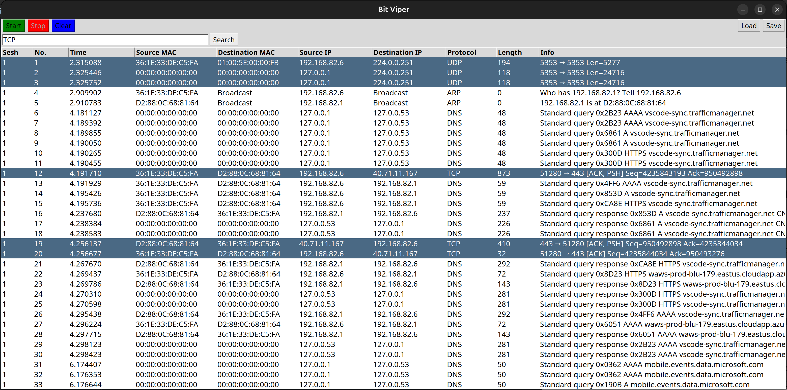

# "BitViper" Packet Sniffer 💻 🛜 🐍

### What is a packet sniffer?
A packet sniffer is a computer program, such as Wireshark, or specialized piece of hardware, such as a packet capture appliance, that logs and can analyze traffic passing over a computer network. It is a masssively helpful and popular tool in network forensics.

### How does the user launch the program?
**Unix-based Systems** (Mac, Linux): `sudo python3 ./gui.py` 
> **Note**: you may first need to create and launch a virtual environment to install `scapy`, which is a dependency of Bit Viper.
> (E.g., `python3 -m venv ~/venv` &rarr; `source ~/venv/bin/activate` &rarr; `pip install scapy`)

**Windows**: `py ./gui.py`

  
   
  <i>BitViper running in an Ubuntu 22.04 Virtual Machine on Mac OS X.</i>

Within the GUI, things are very intuitive: you begin the packet capture process with **Start**, and you end it with **Stop**. You can choose to begin a new capture session by clicking **Start** again, which will increment the Sesh count, and restart the time and packet counters. You can wipe the table with **Clear**, which resets everything. Clicking any column header toggles alpha-numeric sorting of its data. Additionally, you can **Save** and **Load** your own `.pcap` files. At any point, you can analyze individual packets with the **Inspect Payload** feature: right-click on any packet (row), and toggle between the raw hex data and ASCII decodings.

### How is the codebase structured?
The codebase is spread across two files: `gui.py` and `sniffer.py`. The latter can be thought of as a custom library equipped with functions I've written, used to manipulate the incoming packets and the data within them. The former is how the user sees and interacts with the data from a UX/UI experience inside of a graphical user interface (GUI), which makes use of the `tkinter` library.

### What precisely happens when the user clicks **Start**?

1.) **User Interaction:** \
Upon clicking **Start** in the GUI, the associated callback function `startButtonClicked()` is triggered.

2.) **Callback Execution:** \
`startButtonClicked()` initializes the packet sniffing process by calling the `initializePacketSniffing()` function.

3.) **Initialization:** \
Within `initializePacketSniffing()`, necessary data structures are set up, network interfaces are configured using functions like `setupNetworkInterfaces()`, and the packet capture library (i.e., `libpcap`) is initialized.

4.) **Start Packet Capture Loop:** \
After initialization, `initializePacketSniffing()` enters a loop wherein it continuously captures packets by calling `capturePackets()`, which in turn utilizes the packet capture library's functions (e.g., `pcap_loop()`) to capture packets from the network interface(s).

5.) **Packet Filtering:** \
Captured packets are filtered based on user-defined criteria with `applyPacketFilters()`, which examines each packet and determines whether it matches the specified filters, such as protocol type or IP addresses.

6.) **Packet Parsing:** \
Filtered packets are parsed to extract relevant information with `parsePacket()`, which examines the packet's header fields to extract details such as source/destination IP addresses, MAC addresses, and protocol-specific data.

7.) **Data Processing:** \
Extracted packet data is processed according to application requirements by `processPacketData()`, which formats the extracted information for display in the GUI. BitViper hopes to enable the user to perform real-time analysis and editing of this information.

8.) **GUI Update:** \
As new packets are captured and processed, the GUI is updated to reflect the latest information with `updateGUI()`. This modifies GUI components such as tables, graphs, or text fields to display packet details in real-time.

9.) **User Interaction (Optional):** \
While packet capture is ongoing, the user may interact with the GUI to stop and subsequently resume the packet capture process in a new session number, facilitated by `pausePacketCapture()` and `stopPacketCapture()`.

10.) **Packet Capture Termination:** \
Packet capture continues until the user explicitly stops it or a termination condition is met. Upon termination, cleanup tasks are performed using functions like `cleanup()` to close network interfaces and release resources acquired during packet capture.

11.) **Finalization:** \
After packet capture stops, finalization tasks may be executed using functions like `finalizePacketCapture()`, which summarizes captured data, generates reports, or presents analysis results to the user, depending on application requirements.

### What protocols are currently supported?
The following list includes some protocols supported by BitViper (e.g., ARP: "Who has 123.132.34? Tell 456.654.45"). Any unsupported protocol will simply have its protocol number displayed in "Protocol" if still unrecognized by the IANA (see `ALL_PROTOCOLS` under `meta.py`) and raw payload bytestring in "Data".

- **ARP: Address Resolution Protocol** (Layer 2): \
Resolves IP addresses to MAC addresses on a local network segment.

- **IPv4: Internet Protocol Version 4** (Layer 3): \
Provides identification and location addressing for devices on a network and route packets across multiple networks.

- **ICMP: Internet Control Message Protocol** (Layer 3): \
Used for diagnostic and control purposes for IP networks, such as ping.

- **TCP: Transmission Control Protocol** (Layer 4): \
Provides reliable, ordered, and error-checked delivery of data between applications.

- **UDP: User Datagram Protocol** (Layer 4): \
A lightweight, connectionless protocol used for datagram-oriented network communication.

- **HTTP: Hypertext Transfer Protocol** (Layer 7): \
A protocol for transmitting hypermedia documents, such as HTML files, over the internet.

- **HTTPS: Hypertext Transfer Protocol Secure** (Layer 7): \
An extension of HTTP with added security features like encryption and authentication.

- **DNS: Domain Name System** (Layer 7): \
Translates domain names to IP addresses and vice-versa, enabling devices to locate resources on a network using human-readable names.

### List of (known) persistent bugs:
See `bugs.md`.

### Project Vision:
Initially, the motivation for creating this tool was not just to create a clone of Wireshark, albeit in Python. The goal was to do things that Wireshark *doesn't* do, with the ultimate goal of producing a tool that allows users to splice and edit their own custom `.pcap` files. The difficulty of naturally-encountering certain network traffic flow (for testing purposes) is very hard; as a possible solution, custom `.pcap` files could be read and those packets artificially re-transmitted across a network for enriched network testing capabilities.
